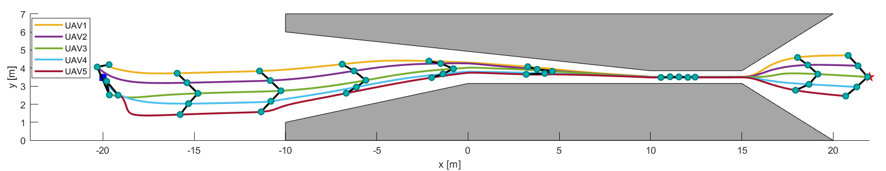
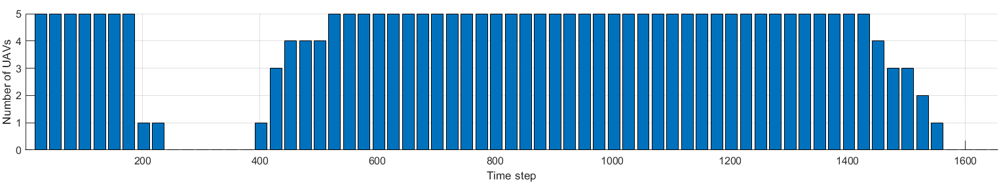
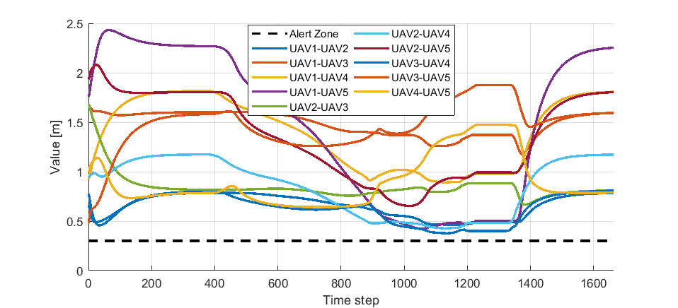
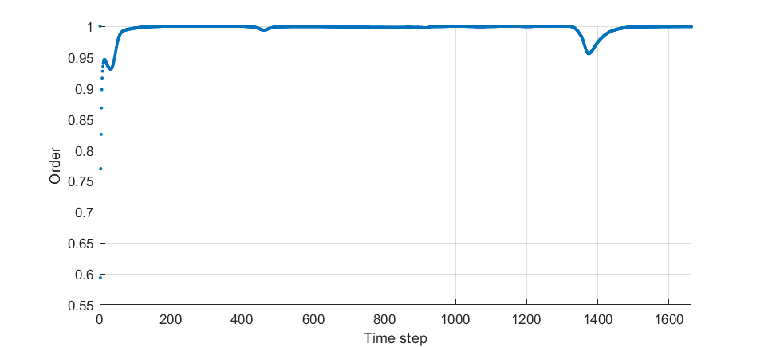
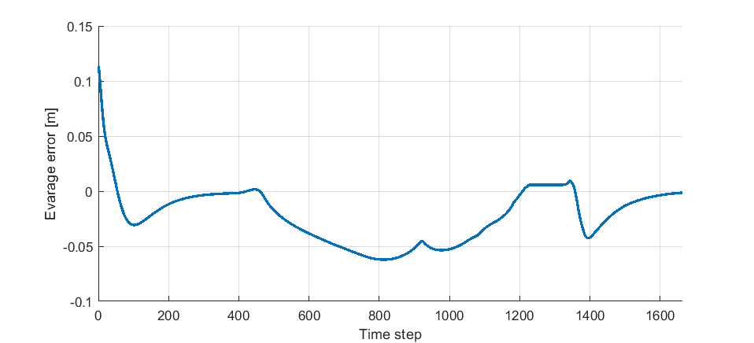

# Self-Reconfigurable V-shape Formation of Multiple UAVs in Narrow Space Environments
This repository presents the MATLAB source code of the following article:

Duy Nam Bui and Manh Duong Phung and Hung Pham Duy, "**Self-Reconfigurable V-shape Formation of Multiple UAVs in Narrow Space Environments**," *The 2024 16th IEEE/SICE International Symposium on System Integration (SII 2024)*, Ha Long, Vietnam, 2024, pp. 1006-1011. [[**IEEE** *Explore*]](https://ieeexplore.ieee.org/document/10417519) [[Citation]](#citation)

### Citation
```
@INPROCEEDINGS{10417519,
  author={Bui, Duy Nam and Phung, Manh Duong and Duy, Hung Pham},
  booktitle={2024 IEEE/SICE International Symposium on System Integration (SII)}, 
  title={Self-Reconfigurable V-Shape Formation of Multiple UAVs in Narrow Space Environments}, 
  year={2024},
  volume={},
  number={},
  pages={1006-1011},
  keywords={Navigation;System integration;Aerospace electronics;Autonomous aerial vehicles;Control systems;Behavioral sciences;Vehicle dynamics;Unmanned aerial vehicles;multi-robot system;distributed control;formation control;reconfiguration},
  doi={10.1109/SII58957.2024.10417519}}
```

### Results



Metrics:




